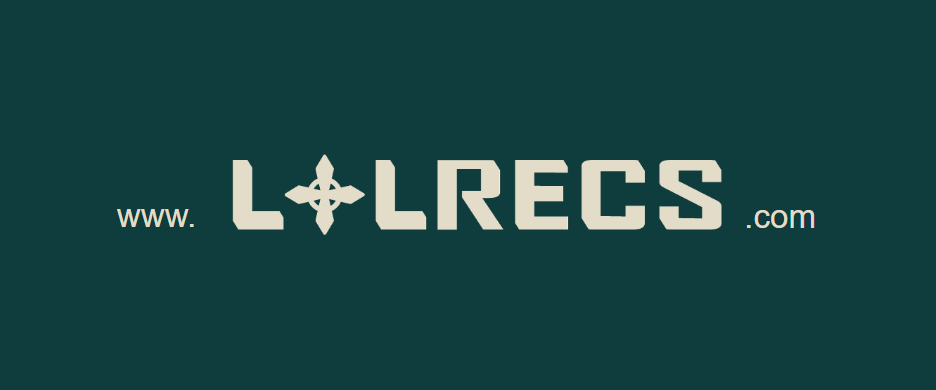
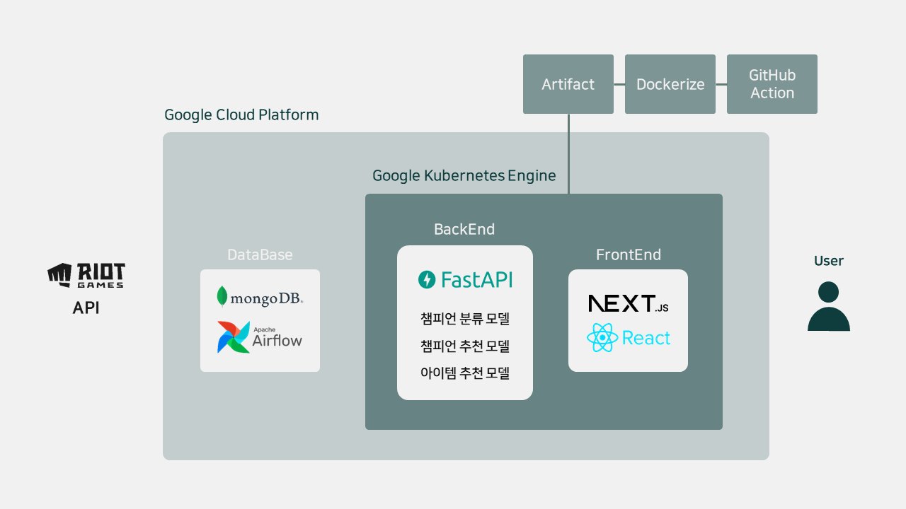

 
 
 

## Members👨‍💻

|        강은비       |  김철현  |         박성현         |         임서연      |     정현석      |
| :-----------------: | :---: | :----------------------: | :--------------------: | :------------: |
|    DB, Modeling     | DB, BE| PM, DB, EB, Modeling |  FE, UI/UX, Modeling | FE, UI/UX, BE |

# Introduction🎮

**LOLRecs** 는 리그오브레전드 플레이어에게 최적화된 챔피언을 추천해주는 서비스입니다.

- 전적 검색, 밴픽 과정에서의 조합을 고려한 챔피언 추천, 그리고 사용자의 포지션과 상대방의 챔피언을 고려한 아이템 추천을 통합적으로 제공합니다.
- 매일 하고싶은 챔피언과, 조합에 맞지 않는 챔피언만 하다보면 티어는 제자리에 머물게 되어있기 마련입니다. 실시간으로 밴이 된 챔피언과 아군, 적군이 픽한 챔피언을 토대로 추천받은 챔피언과 함께라면 당신의 티어는 수직상승할 것 입니다. 

# Contribution🌟

- 랭크게임을 시작한 지 얼마 되지 않은 유저들을 위한 코파일럿 추천 서비스입니다.
- Deep Learning 모델을 이용해 실시간 상황과 유저에게 맞춤화되어있는 챔피언과 아이템을 추천해드립니다.
- 응용 프로그램 설치 없이 모든 기능을 이용할 수 있습니다.

지금 바로 함께할 챔피언을 찾아보세요!

<a href="https://www.lolrecs.com" style="color: green; font-weight: bold">LOLRecs</a>

# Architecture

