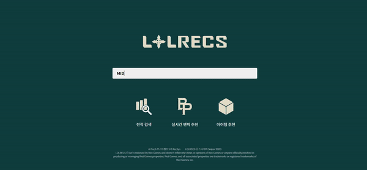
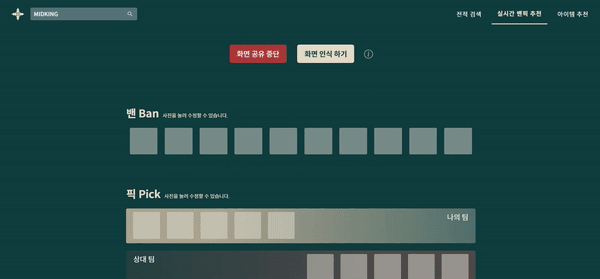
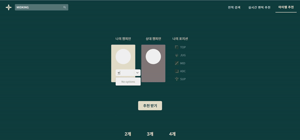

 
 
 

---
# Introduction🎮
# BackGround📋

**LOLRecs는 리그오브레전드 플레이어에게 최적화된 챔피언을 추천해주는 서비스입니다.**

- 롤 게임에서 유저들은 승리하기 위해 적절한 챔피언을 선택해야 하고 적절한 아이템 선택하기 위해 심사숙고해야 합니다. 롤은 지속적인 업데이트로 현재 선택할 수 있는 챔피언 수가 164가지, 전체 아이템 개수는 279개에 달합니다. 이렇게 방대한 선택지 중에서 최적의 선택을 하는 것은 숙련자에게도 어려운 일이며, 신규 유저의 롤 진입장벽은 점점 높아지게 됩니다.
- 롤과 관련한 여러 사이트에서는 이러한 문제를 해결하고자 통계 기반의 방식으로 아이템과 챔피언을 추천해주고있지만, 이는 실시간으로 유저가 처한 상황을 반영하지 못합니다. 
- **LolRecs**는 기본적인 전적 검색과 더불어 실시간 밴픽 과정에서의 조합을 고려한 챔피언 추천, 그리고 사용자의 포지션과 상대방의 챔피언을 고려한 아이템 추천을 제공합니다. 
---
# Contribution💡

- 랭크게임을 시작한 지 얼마 되지 않은 유저들을 위한 코파일럿 추천 서비스입니다.
- Deep Learning 모델을 이용해 실시간 상황과 유저에게 맞춤화되어있는 챔피언과 아이템을 추천해드립니다.
- 응용 프로그램 설치 없이 모든 기능을 이용할 수 있습니다.

 
매일 하고싶은 챔피언과, 조합에 맞지 않는 챔피언만 하다보면 티어는 제자리에 머물게 되어있기 마련입니다. 

실시간으로 밴이 된 챔피언과 아군, 적군이 픽한 챔피언을 토대로 추천받은 챔피언과 함께라면 당신의 티어는 수직상승할 것 입니다. 

**지금 바로 함께할 챔피언을 찾아보세요!**

**<a href="https://www.lolrecs.com" style="color: green; font-weight: bold">LOLRecs</a>**

---
# Feature🌟

1. 전적검색

2. 실시간 밴픽 추천
- 밴픽창 화면 인식을 통해 유저에게 가장 적합한 챔피언을 추천해드립니다

3. 아이템 추천
- 유저, 상대방의 챔피언 및 포지션에 가장 적합한 아이템을 추천해드립니다

---
# MODEL🚀

1. 챔피언 인식 모델
- 화면인식기를 통해 현재 게임 창 이미지를 캡처하고, 20명의 챔피언 이미지를 잘라내어 분류 과정을 거쳐, 최종적으로 어떤 챔피언이 밴픽되었는지 인식하는 모델입니다. 
- 이미지 분류 모델로는 잘 알려진 CNN을 사용하였고, 서버 통신간 속도 저하를 최대한 막기 위해 층을 적게 쌓아 용량을 줄였습니다. 입력 데이터 이미지가 이미 정해진 기존 프로필 챔피언 이미지이기 때문에 가능했습니다.
- 훈련 데이터를 만들기 위해 imgaug 라이브러리를 이용하여, 기존 챔피언 프로필 이미지에 다양한 변형을 가하여 데이터를 증가시켰습니다. 웹페이지 이용자가 화면 인식 기능을 사용할 때 다른 창이나 마우스 기호 등 방해 받는 경우도 고려해 일부 마스킹 처리한 이미지도 추가하였습니다.
 

2. 챔피언 추천 모델

 

- 밴픽은 플레이어들이 순차적으로 챔피언을 선택하는 과정으로, 챔피언을 추천하기 위해선 이전 플레이어가 선택한 챔피언이 다음 플레이어의 선택에 영향을 준다는 점과 선택된 챔피언들 간의 관계를 모두 고려해야합니다. 
- Transformer의 경우 self-attention을 활용하여 입력 sequence를 한번에 처리하기 때문에 실시간 밴픽 추천에 적합합니다.
    

3. 아이템 추천 모델
- 사용자의 챔피언, 예상되는 상대 챔피언 그리고 포지션을 고려하여 아이템을 추천해주었습니다.
- 라이엇 Match v5 API로부터 수집한 raw 데이터를 (사용자 챔피언, 상대 챔피언, 사용자 챔피언이 사용한 아이템, 승리여부) 요소들로 구성된 데이터로 재가공하였습니다.
- 챔피언이 사용한 아이템들에 대해서 등장 횟수, 승률 등을 고려하여 통계기반으로 추천을 해주었습니다.
 
  
---
# Architecture🔧

---
# Members👨‍💻

<table>
  <tr height="125px">
    <td align="center" width="180px">
      
    </td>
    <td align="center" width="180px">
      
    </td>
    <td align="center" width="180px">
      
    </td>
    <td align="center" width="180px">
      
    </td>
    <td align="center" width="180px">
      

  </tr>
  <tr height="70px">
    <td align="center" width="180px">
      <a href="https://github.com/ebbbi">강은비</a>
    </td>
    <td align="center" width="180px">
      <a href="https://github.com/Risk-boy">김철현</a>
    </td>
    <td align="center" width="180px">
      <a href="https://github.com/Puer-Hyun">박성현</a>
    </td>
    <td align="center" width="180px">
      <a href="https://github.com/serulean">임서연</a>
    </td>
    <td align="center" width="180px">
      <a href="https://github.com/Aiden-Jung">정현석</a>
    </td>
  </tr>
  <tr>
      <td align="center">DB MODELING</td>
      <td align="center">DB BE</td>
      <td align="center">PM, DB BE, Modeling</td>
      <td align="center">FE, UI/UX Modeling</td>
      <td align="center">FE, BE UI/UX</td>
   </tr>
</table>

